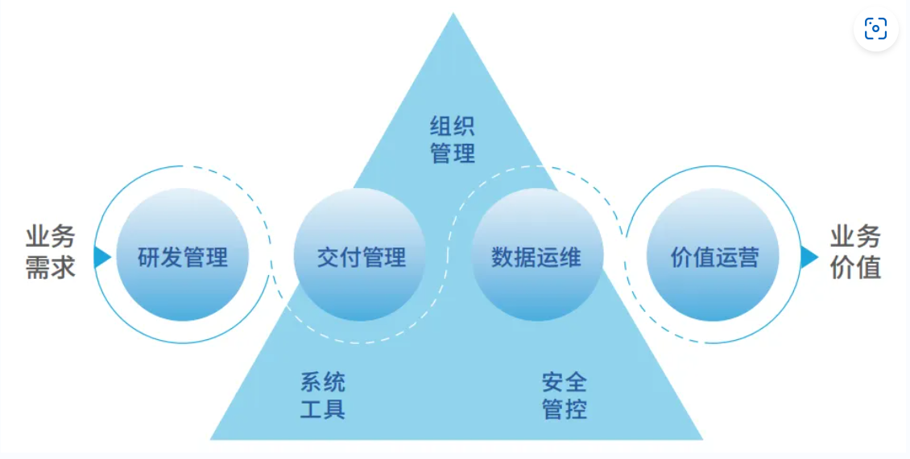

# 一、什么是DataOps
DataOps是一个相对现代的术语，由Lenny Liebmann于2014年首次提出。从本质上讲，DataOps是一种面向流程的方法，用于提高分析和数据团队使用的数据分析的质量和缩短周期时间。DataOps将数据分析和运营团队统一起来，更快、更准确地提供分析解决方案和产品。
DataOps能力模型围绕数据开发流水线，从业务需求出发，以创造业务价值为目标，形成“4+3”的能力框架，即4个核心环节和3项实践保障。

# 二、DataOps与DevOps

## 2.1、关联

支持 DataOps 的许多原则都源自 DevOps 中的类似原则。企业需要 DevOps 来生成高质量、统一的软件和功能开发框架。在数据驱动方面，企业依靠这些特征来进行敏捷的数据工程和分析。
由于 DataOps 使用相同的 DevOps 工具链，因此对于拥有 DevOps 框架的企业来说，利用它非常简单。以下是 DataOps 从 DevOps 中获得的一些主要思想：

- 快速增长
- 重用和自动化
- 专注于提供市场价值
- 自动测试和代码推广
- 持续集成和持续交付 (CI/CD)

## 2.2、差异
**方法**
DataOps 和 DevOps 具有相当的交互特征。但是，后者具有实时和交互的数据管道和分析开发过程；前者包括软件开发和交付方法。
**编排**
应用程序源代码不需要在 DevOps 方法中进行广泛的编排。在 DataOps 中，数据管道和分析开发编排是必需的组件。尽管编排数据流一直在发生（例如，ETL/ELT 流程），但在应用程序开发和 DevOps 过程中通常没有这样的管道协调。
**数据管理**
在 DevOps 中，数据模式、管理和授权更改是微不足道的。在 DataOps 中，他们是前台。
**工具**
DataOps 的诞生是由 DevOps 带来的，而支持它所需的工具仍处于早期阶段。虽然 DevOps 中的测试主要是自动化的，但 DataOps 并没有相同的待遇。大多数用户必须修改测试自动化软件或从头开始开发自己的软件。
