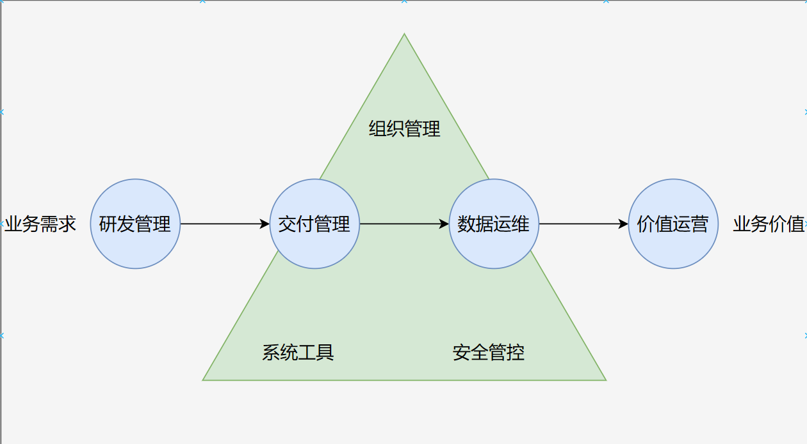

# 一、什么是DataOps
DataOps是一个相对现代的术语，由Lenny Liebmann于2014年首次提出。从本质上讲，DataOps是一种面向流程的方法，用于提高分析和数据团队使用的数据分析的质量和缩短周期时间。DataOps将数据分析和运营团队统一起来，更快、更准确地提供分析解决方案和产品。
DataOps能力模型围绕数据开发流水线，从业务需求出发，以创造业务价值为目标，形成“4+3”的能力框架，即4个核心环节和3项实践保障。

## 1.1、核心环节
**数据研发管理**
数据研发管理是指以研发治理一体化为目标，构建标准化的数据开发流程。企业在数据开发阶段，构建数据研发治理一体化流程，将数据治理工作前置，把数据治理工作与数据开发工作有机结合，能够加强数据治理与开发工作的协同配合，同时降低数据治理后置所产生的风险。此外，在数据研发阶段加强对数据需求的约束，并利用自助分析能力来提前探查或解决部分数据需求，大幅提升了数据需求的沟通效率，减少了部分研发工作压力。数据研发管理包括需求管理、设计管理、数据开发和自助分析四部分内容。

**数据交付管理**
数据交付管理是指以提升交付效率和质量为目标，建设持续测试和交付能力。企业在数据的交付与部署阶段，通过构建自动化的测试和交付流水线，加强数据版本与代码质量的管理，帮助企业提升数据产品交付的自动化水平，加快交付速度，提高交付质量。数据交付管理包括配置管理、测试管理、部署与发布管理三部分内容。

**数据运维**
数据运维是指以全面立体的持续监控、发现、处理数据问题为目标，构建全链路可观测能力。企业通过构建全链路数据可观测能力，通过对数据研发运营管理全生命周期的效能、资源、质量、成本等方面进行系统性的监测与度量，帮助企业全面掌握数据研发运营的各环节情况，及时发现问题、反馈问题、处理问题，进而不断优化数据开发全流程。数据运维包括监控管理、资源管理、变更管理、异常管理、持续优化五部分内容。

**价值运营**
价值运营是指以精益运营数据为目标，打造量化驱动变革的能力。企业基于量化指标对数据开发工作的成本进行精细化管理，并驱动企业对经营管理、开发流程和系统工具持续优化，形成“以数治数，持续革新”的闭环运营。价值运营包括成本管理、持续变革、量化驱动三部分内容。

## 1.2、实践保障
**系统工具**
系统工具是指以企业“业务用数，研发供数”的实际流程为基础，构建一体化的技术平台。系统工具是企业实践DataOps理念的抓手，通过搭建完整且成熟的DataOps工具链，能够为企业的一体化数据研发治理能力提供强有力的技术支撑。DataOps系统工具应具备强大的工具链集成能力，能够整合企业现有的数据治理工具（如数据质量管理工具、数据安全管控工具、元数据管理工具等）和数据开发工具（如ETL工具、数据仓库、数据科学平台等）。通过高度集成这些工具，企业内部可以形成一条完整、流畅的数据流水线，支持通过统一数据门户集中展现和管理，并为不同角色的用户提供便捷访问、使用、共享数据资源的能力，从而实现数据服务的自助化和标准化。

**组织管理**
组织管理是指以打造敏捷、协同的数据驱动型组织为目标，优化组织架构、明晰岗位职能。通过重构组织架构、岗位角色及协同机制配合DataOps流水线运行。组织管理包括组织架构、岗位角色、协作协同三部分。

**安全管控**
安全管控是指以保证个人隐私、数据安全为目标，将安全管控嵌入到数据流水线中，构建数据研发全生命周期的安全管理能力。

# 二、DataOps与DevOps

## 2.1、关联

支持 DataOps 的许多原则都源自 DevOps 中的类似原则。企业需要 DevOps 来生成高质量、统一的软件和功能开发框架。在数据驱动方面，企业依靠这些特征来进行敏捷的数据工程和分析。
由于 DataOps 使用相同的 DevOps 工具链，因此对于拥有 DevOps 框架的企业来说，利用它非常简单。以下是 DataOps 从 DevOps 中获得的一些主要思想：

- 快速增长
- 重用和自动化
- 专注于提供市场价值
- 自动测试和代码推广
- 持续集成和持续交付 (CI/CD)

## 2.2、差异
**方法**
DataOps 和 DevOps 具有相当的交互特征。但是，后者具有实时和交互的数据管道和分析开发过程；前者包括软件开发和交付方法。
**编排**
应用程序源代码不需要在 DevOps 方法中进行广泛的编排。在 DataOps 中，数据管道和分析开发编排是必需的组件。尽管编排数据流一直在发生（例如，ETL/ELT 流程），但在应用程序开发和 DevOps 过程中通常没有这样的管道协调。
**数据管理**
在 DevOps 中，数据模式、管理和授权更改是微不足道的。在 DataOps 中，他们是前台。
**工具**
DataOps 的诞生是由 DevOps 带来的，而支持它所需的工具仍处于早期阶段。虽然 DevOps 中的测试主要是自动化的，但 DataOps 并没有相同的待遇。大多数用户必须修改测试自动化软件或从头开始开发自己的软件。

## 2.3、数据开发 VS 软件研发
**需求与设计阶段**
在需求阶段和设计阶段，数据研发和软件研发的差异并不明显。软件研发关注的是软件的架构设计和需求的流转，而数据研发则更关注数据的来源、分布以及数据研发的架构等问题。
**研发阶段**
在研发阶段，数据研发和软件研发的方法和流程相似。两者都需要经过需求分析、设计、编码和测试等步骤。但数据研发更注重数据的处理和转换，而软件研发则更注重功能实现和代码质量。
**测试阶段**
在测试阶段，数据研发和软件研发的差异较为明显。
- 软件测试：在需求评审阶段，测试人员已经明确了解点击某个按钮或发起某种请求后应该得到的结果。测试周期通常较短，测试人员和研发人员可以快速沟通并修复bug。
- 数据测试：数据测试过程更为复杂。在需求提出时，可能对数据结果不够明确，结果的判断需要依赖研发人员或业务人员的经验，或通过其他数据搭配可视化分析工具来辅助结果确认。数据测试周期较长，一些大型复杂的数据加工任务可能会经过一个月甚至更长的时间才能得到测试结果。
**运维阶段**
软件系统的运维阶段，侧重于保障软件系统的稳定运行，处理故障、优化性能、进行系统升级等，以确保业务的连续性。而对于数据来说，除了运维以外，更应该关注的是数据运营，要持续关注数据安全、数据质量等问题。

DataOps从研发管理到运营管理的所有阶段，都可以在任务调度系统中完成。任务调度系统在整个数据加工链路中扮演核心角色，是解决DataOps困境的关键入口。所以结合DataOps与任务调度系统可以更好的解决企业在实施任务调度系统和DataOps平台的困境。数据研发与软件研发虽然在某些阶段和流程上有相似之处，但在测试和运维阶段的差异尤为明显。理解这些差异对于有效实施DataOps至关重要。通过采用适当的工具和方法，企业可以更好地应对数据研发中的挑战，提升用户体验，提高数据处理的效率和质量。

# 三、实现 DataOps 的工具（开源）
- 数据集成：Seatunnel、DataX
- 存储引擎：Hive(HDFS、OSS)、MPP（CK、Doris、StarRocks）
- 计算引擎：spark、flink
- 数据版本控制：Git
- 任务调度：Dolphin Scheduler
- 数据监控和告警：Prometheus、Grafana
- CI/CD 管道：Jenkins、GitLab CI/CD

# 四、调度器选择
## 4.1、挑战
**挑战一：稳定性**
要求企业对任务调度系统的首要要求是稳定性，要充分确保数据加工任务和业务的连续性，同时系统也需要具备一定的风险抵抗和预警能力，以应对突发状况。Apache DolphinScheduler采用核心的分布式去中心化架构，并结合服务融合机制，能够充分保证系统的稳定性。即使在极端情况下，部分节点丢失也不会立即导致系统崩溃。通过Master和Worker机制及其队列处理机制，系统可以有效避免服务器崩溃的情况。
**挑战二：处理复杂多样的数据加工任务**
不同企业的数据加工任务场景会有所差异，最好是能够万全兼容原有数据加工任务和场景。对于一些不常见的情况，也要求二次开发成本尽可能低。Apache DolphinScheduler目前支持38种数据加工类型节点，能够覆盖大多数企业的数据加工需求。如果遇到极端或不常见的情况，Apache DolphinScheduler的代码结构规范简单，二次开发成本低，可以轻松增加新的数据类型节点。
**挑战三：使用简单**
企业在选型任务调度系统时，功能的多样性和操作的简便性同样重要。Apache DolphinScheduler提供了可视化的拖拉拽DAG编辑页面，对用户非常友好，降低了学习成本。对于技术人员和业务人员来说，传统的脚本式开发工具学习成本高，而DAG编辑页面则更易于接受和使用。
**挑战四：系统的可扩展性任务**
调度系统需要具备灵活的扩展和缩容能力，以适应企业业务的发展和变更。在扩展过程中，不能对现有任务产生任何影响。Apache DolphinScheduler通过其分布式架构，可以在不影响现有任务的情况下进行系统扩展和缩容，确保系统的高效运行。