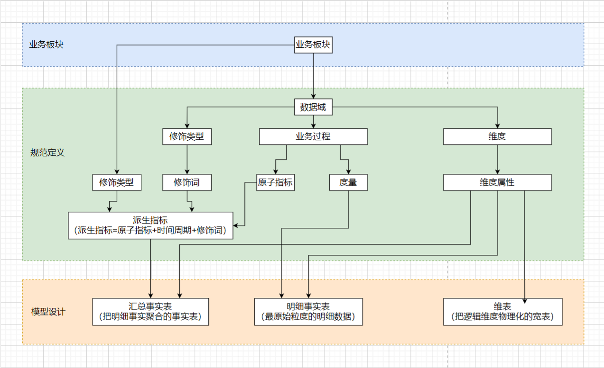
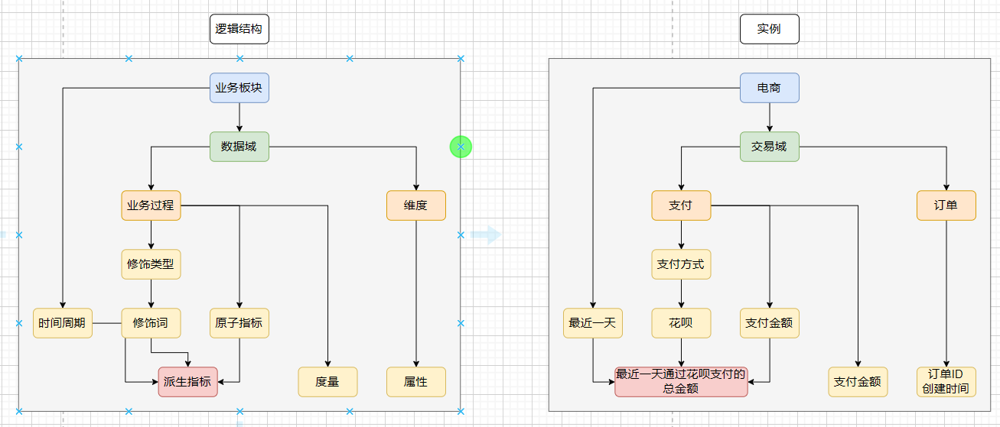
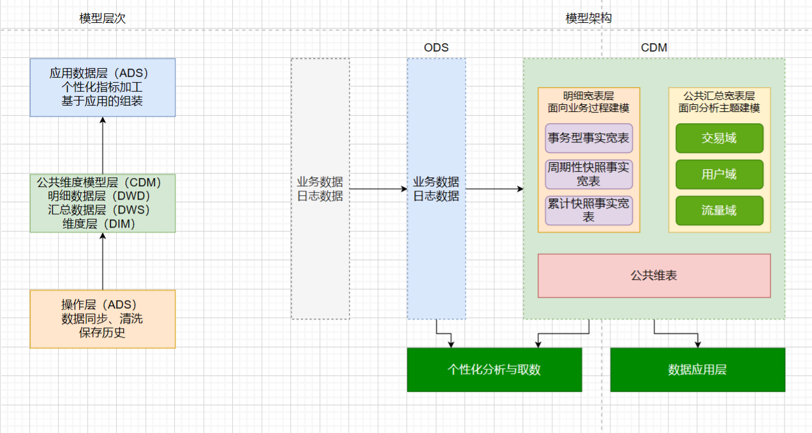
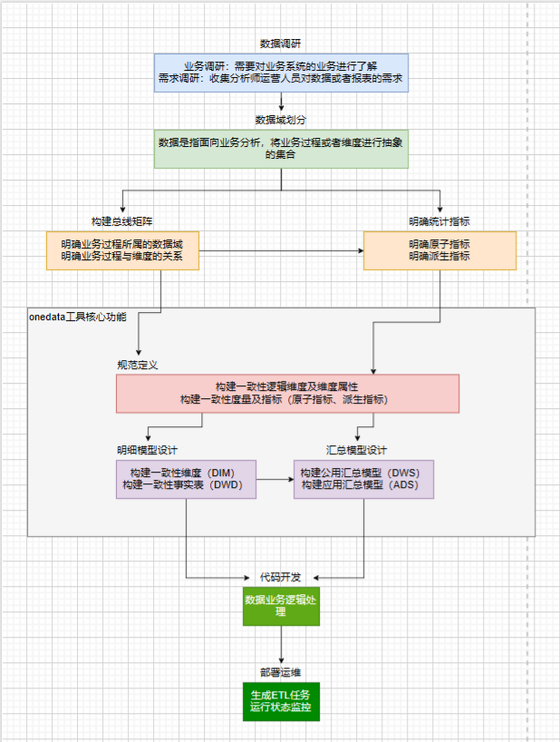

# 一、大数据领域建模综述

## 1.1、为什么需要数据建模

有了适合业务和基础数据存储环境的模型，那么大数据就能获得以下好处。

- 性能:良好的数据模型能帮助我们快速查询所需要的数据，减少数据的I/O吞吐。
- 成本:良好的数据模型能极大地减少不必要的数据冗余，也能实现计算结果复用，极大地降低大数据系统中的存储和计算成本。
- 效率:良好的数据模型能极大地改善用户使用数据的体验，提高使用数据的效率。
- 质量:良好的数据模型能改善数据统计口径的不一致性，减少数据计算错误的可能性。

大数据系统需要数据模型方法来帮助**更好地组织和存储数据，以便在性能、成本、效率和质量之间取得最佳平衡**。

## 1.2、从OLTP和OLAP系统的区别看模型方法论的选择

OLTP系统通常面向的主要数据操作是随机读写，主要采用满3NF的实体关系模型存储数据，从而在事务处理中解决数据的冗余和一致性问题；而OLAP系统面向的主要数据操作是批量读写，事务处理一致性不是OLAP关注的，其主要关注**数据的整合，以及在一次性复杂大数据查询和处理中的性能**，因此它需要采用一些不同的数据建模方法。

## 1.3、典型的数据仓库建模方法论

### 1.3.1、ER模型

数据仓库之父Bill Inmon提出的建模方法是从全企业的高度设计一个3NF模型，用实体关系（Entity Relationship, ER）模型描述企业业务，在范式理论上符合3NF。数据仓库中的3NF与OLTP系统中的3NF的区别在于，它是站在企业角度面向主题的抽象，而不是针对某个具体业务流程的实体对象关系的抽象。其具有以下几个特点：

- 需要全面了解企业业务和数据
- 实施周期非常长
- 对建模人员的能力要求非常高

采用ER模型建设数据仓库模型的出发点是整合数据，将各个系统中的数据以整个企业角度按主题进行相似性组合和合并，并进行一致性处理，为数据分析决策服务，但是并不能直接用于分析决策。
其建模步骤分为三个阶段。

- 高层模型:一个高度抽象的模型，描述主要的主题以及主题间的关系，用于描述企业的业务总体概况。
- 中层模型:在高层模型的基础上，细化主题的数据项。
- 物理模型（也叫底层模型）:在中层模型的基础上，考虑物理存储，同时基于性能和平台特点进行物理属性的设计，也可能做一些表的合并、分区的设计等。

ER 模型在实践中最典型的代表是Teradata公司基于金融业务发布的FS-LDM(Financial Services Logical Data Model)，它通过对金融业务的高度抽象和总结，将金融业务划分为10大主题，并以设计面向金融仓库模型的核心为基础，企业基于此模型做适当调整和扩展就能快速落地实施。

### 1.3.2、维度模型

维度模型是数据仓库领域的Ralph Kimball大师所倡导的，他的The Data Wrehouse Toolkit-The Complete Guide to Dimensional Modeling是数据仓库工程领域最流行的数据仓库建模的经典。
维度建模**从分析决策的需求出发构建模型**，为分析需求服务，因此它**重点关注用户如何更快速地完成需求分析，同时具有较好的大规模复杂查询的响应性能**。其典型的代表是星形模型，以及在一些特殊场景下使用的雪花模型。
其设计分为以下几个步骤。

- **选择需要进行分析决策的业务过程**。业务过程可以是单个业务事件，比如交易的支付、退款等；也可以是某个事件的状态，比如当前的账户余额等；还可以是一系列相关业务事件组成的业务流程，具体需要看我们分析的是某些事件发生情况，还是当前状态，或是事件流转效率。
- **选择粒度**。在事件分析中，我们要预判所有分析需要细分的程度，从而决定选择的粒度。粒度是维度的一个组合。
- **认识维表**：选择好粒度之后，就需要基于此粒度设计维表，包括维度属性，用于分析时进行分组和筛选。
- **选择事实**：确定分析需要衡量的指标。

在不太成熟、快速变化的业务面前，构建ER模型的风险非常大，不太适合去构建ER模型。

### 1.3.3、Data Vault模型

### 1.3.4、Anchor模型

# 二、数据整合以及管理体系

## 2.1、概述

大数据系统建设不断追求的方向：对数据进行有序和有结构地分类组织和存储，避免重复建设和数据不一致性，保证数据的规范性。
大数据建设的核心是：：从业务架构设计到模型设计，从数据研发到数据服务，做到数据可管理 、可追溯、可规避重复建设。

### 2.1.1、定位及价值

建设统一的、规范化的数据接入层（ODS）和数据中间层（DWD、DWS），通过数据服务和数据产品，完成大数据系统建设 ，即数据公共层建设。提供标准化的（Standard）、共享的（Shared）、数据服务（Service）能力，降低数据互通成本，释放计算、存储、人力等资源，以消除业务和技术之痛。

### 2.1.2、体系架构

业务板块：根据业务的属性划分出几个相对独立的业务板块，业务板块之间的指标或业务重叠性较小。
规范定义：规范定义将会被用在模型设计中。
模型设计：以维度建模理论为基础，基于维度建模总线架构，构建一致性的维度和事实（进行规范定义）。

## 2.2、规范定义

规范定义指以维度建模作为理论基础，构建总线矩阵，划分和定义数据域、业务过程、维度、度量 原子指标、修饰类型、修饰词、时间周期、派生指标。

### 2.2.1、名词术语

**数据域**
指面向业务分析，将业务过程或者维度进行抽象的集合。其中，业务过程可以概括为一个个不可拆分的行为事件，在业务过程之下，可以定义指标；维度是指度量的环境，如买家下单事件，买家是维度。为保障整个体系的生命力，数据域是需要抽象提炼，并且长期维护和更新的，但不轻易变动。在划分数据域时，既能涵盖当前所有的业务需求，又能在新业务进入时无影响地被包含进已有的数据域中和扩展新的数据域
**业务过程**
指企业的业务活动事件，如下单、支付、退款都是业务过程。请注意，业务过程是一个不可拆分的行为事件，通俗地讲，业务过程就是企业活动中的事件
**时间周期**
用来明确数据统计的时间范用或者时间点，如最近30天、自然周、截至当日等
**修饰类型**
是对修饰词的一种抽象划分。修饰类型从属于某个业务域，如日志域的访问终端类型涵盖无线端、 端等修饰词
**修饰词**
指除了统计维度以外指标的业务场景限定抽象。修饰词隶属于一种修饰类型，如在日志域的访问终端类型下，有修饰词PC端、无线端等
**度量/原子指标**
原子指标和度量含义相同，基于某一业务事件行为下的度量，是业务定义中不可再拆分的指标，具有明确业务含义的名词 ，如支付金额
**维度**
维度是度量的环境，用来反映业务的一类属性，这类属性的集合构成一个维度，也可以称为实体对象。维度属于一个数据域，如地理维度（其中包挤国家、地区、省以及城市等级别的内容）、时间维度（其中包括年、季、月、周、日等级别的内容）
**维度属性**
维度属性隶属于一个维度，如地理维度里面的国家名称、同家 ID 、省份名称等都属于维度属性
**派生指标**
派生指标 ＝ 一个原子指标 ＋ 多个修饰词（可选）＋ 时间周期。可以理解为对原子指标业务统计范罔的圈定。如原子指标：支付金额，最近1天海外买家支付金额则为派生指标（最近1天为时间周期 海外为修饰词 买家作为维度，而不作为修饰词）

### 2.2.2、指标体系

**基本原则**
1、组成体系之间的关系

- 派生指标 ＝ 一个原子指标 ＋ 多个修饰词（可选）＋ 时间周期。
- 原子指标、修饰类型及修饰词，直接归属在业务过程下，其中修饰词继承修饰类型的数据域。
- 派生指标可以选择多个修饰词，修饰词之间的关系为“或”或者“且”，由具体的派生指标语义决定。
- 派生指标唯一归属一个原子指标 ，继承原子指标的数据域， 与修饰词的数据域无关。
  一般而言，事务型指标和存量型指标只会唯一定位到一个业务过程，如果遇到同时有两个行为发生、需要多个修饰词、生成一个派生指标的情况，则选择时间靠后的行为创建原子指标，选择时间靠前的行为创建修饰词。
- 原子指标有确定的英文字段名、数据类型和算法说明；派生指标要继承原子指标的英文名、数据类型和算法要求。

2、命名约定

- 命名所用术语。指标命名，尽量使用英文简写，其次是英文，指标英文名太长时，可考虑用汉语拼音首字母命名。
- 业务过程。英文名:用英文或英文的缩写或者中文拼音简写；中文名：具体的业务过程中文即可。
  关于存量型指标对应的业务过程的约定：实体对象英文名+_stock。如在线会员数、 一星会员数等，其对应的业务过程为mbr_stock。在线商品数、商品SKU种类小于5的商品数，其对应的业务过程为itm_stock。
- 原子指标。英文名:动作＋度量：中文名：动作＋度量。原子指标必须挂靠在某个业务过程下。
- 修饰词。只有时间周期才会有英文名，且长度为2位，加上“_”为3位，例如_1d。其他修饰词无英文名。

  | 中文名       | 英文名 |
  | -------------- | -------- |
  | 最近1天      | 1d     |
  | 最近3天      | 3d     |
  | 最近7天      | 1w     |
  | 最近14天     | 2w     |
  | 最近30天     | 1m     |
  | 最近60天     | 2m     |
  | 最近90天     | 3m     |
  | 最近180天    | 6m     |
  | 180天以前    | bh     |
  | 自然周       | cw     |
  | 自然月       | cm     |
  | 自然季度     | cq     |
  | 截至当日     | td     |
  | 年初截至当日 | sd     |
  | 零点截至当前 | tt     |
  | 财年         | fy     |
  | 最近1小时    | 1h     |
  | 准实时       | ts     |
  | 未来七天     | f1w    |
  | 未来四周     | g4w    |
- 派生指标。英文名:原子指标英文名 ＋ 时间周期修饰词(3位，例如_1d) ＋ 序号（4位，例如_001）中文名：时间周期修饰词 ＋ ［其他修饰词］＋ 原子指标。
  为了控制派生指标的英文名称过长，在英文名的理解和规范上做了取舍，所有修饰词的含义都纳入了序号中。序号是根据原子指标＋派生指标自增的。

3、算法
原子指标、修饰词、派生指标的算法说明必须让各种使用人员看得明白，包括

- 算法概述 - 算法对应的用户容易理解的阐述。
- 举例 - 通过具体例子帮助理解指标算法。
- SQL算法说明 - 对于派生指标给出SQL的写法或者伪代码。

**操作细则**
1、派生指标的种类
派生指标可以分为三类：事务型指标、存量型指标和复合型指标。按照其特性不同，有些必须新建原子指标，有些可以在其他类型原子指标的基础上增加修饰词形成派生指标。

- 事务型指标：是指对业务活动进行衡量的指标。例如新发商品数、重发商品数、新增注册会员数、订单支付金额，这类指标需维护
  原子指标及修饰词，在此基础上创建派生指标。
- 存量型指标：是指对实体对象（如商品、会员）某些状态的统计。例如商品总数、注册会员总数，这类指标需维护原子指标及修饰
  词，在此基础上创建派生指标，对应的时间周期一般为“历史截至当前某个时间”。
- 复合型指标：是在事务型指标和存量型指标的基础上复合而成的。例如浏览UV-下单买家数转化率，有些需要新建新原子指标，有些则可以在事务型或存量型原子指标的基础上增加修饰词得到派生指标。

2、复合指标的规则

- 比率型：创建原子指标，如CTR、浏览UV-下单买家数转化率、满意率等。例如，“最近1天店铺首页CTR”，原子指标为“ CTR”，时间周期为“最近1天”，修饰类型为“页面类型”，修饰词为“店铺首页”。
- 比例型：创建原子指标，如百分比、占比。例如“最近1天无线支付金额占比”，原子指标为“支付金额占比”，修饰类型为“终端类型”，修饰词为“无线”。
- 变化量型：不创建原子指标，增加修饰词，在此基础上创建派指标。例如，“最近1天订单支付金额上1天变化量”，原子指标为“订单支付金额”，时间周期为“最近1天”，修饰类型为“统计方法”，修饰词为“上1天变化量”。
- 变化率型：创建原子指标。例如，“最近1天海外买家支付金额上七天变化率”，原子指标为“支付金额变化率”，修饰类型为“买家地域”，修饰词为“海外买家”。
  -统计型（均值、分位数等）：不创建原子指标，增加修饰词，在此基础上创建派生指标；在修饰类型 “统计方法”下增加修饰词，如人均、日均、行业平均、商品平均90分位数、70分位数等。例如，“自然月日均UV”，原子指标为“UV”，修饰类型为“统计方法”，修饰词为“日均”。
- 排名型：创建原子指标，一般为top_xxx xxx，有时会同时选择rank和top_xxx _xxx 组合使用。创建派生指标时选择对应的修饰
  词如下：
  - 统计方法（如降序、升序）
  - 排名名次（如TOP 10）
  - 排名范围（如行业、省份、一级来源等）
  - 根据什么排序（如搜索次数、PV）
- 对象集合型：主要是指数据产品和应用需要展现数据时，将一些对象以k-v对的方式存储在一个字段中，方便前端展现。比如趋势图、TOP排名对象等。其定义方式是，创建原子指标，一般为xxx串：创建派生指标时选择对应的修饰词如下：
  - 统计方法（如降序、升序）
  - 排名名次（如TOP10）
  - 排名范围（如行业、区域）

**其他规则**
1、上下层级派生指标同时存在时
如最近1天支付金额和最近 1天PC端支付金额，建议使用前者，PC端作为维度属性存放在物理表中体现。
2、父子关系原子指标存在时
当父子关系原子指标存在时，派生指标使用子原子指标创建派生指标。如PV、IPV（商品详情页 PV），当统计商品详情页PV时，优先选择子原子指标。

## 2.3、模型设计

### 2.3.1、指导理论

数据模型的维度设计主要以维度建模理论为基础，基于维度数据模型总线架构，构建一致性的维度和事实。

### 2.3.2、模型层次

表数据模型分为三层 ：操作数据层（ODS）、公共维度模型层（CDM）和应用数据层（ADS），其中公共维度模型层包括明细数据层（DWD）和汇总数据层（DWS）。
**操作数据层（ODS）**：把操作系统数据几乎无处理地存放在数据仓库系统中。

- 同步：结构化数据增量或全量同步到MaxCompute
- 结构化：非结构化（日志）结构化处理并存储至MaxCompute
- 累积历史、清洗：根据数据业务需求及稽核和审计要求保存历史数据、清洗数据

**公共维度模型层（CDM）**：存放明细事实数据、维表数据及公共指标汇总数据，其中明细事实数据、维表数据一般根据ODS层数据加工生成；公共指标汇总数据一般根据维表数据和明细事实数据加工生成。
CDM层又细分为DWD层和DWS层，分别是明细数据层和汇总数据层，采用维度模型方法作为理论基础，更多地采用一些维度退化手法，将维度退化至事实表中，减少事实表和维表的关联，提高明细数据易用性；同时在汇总数据层，加强指标的维度退化，采取更多的宽表手段构建公共指标数据层，提升公共指标的复用性，减少重复加工。其主要功能如下。

- 组合相关和相似数据：采用明细宽表，复用关联计算，减少数据扫描。
- 公共指标统一加工：基于OneData体系构建命名规范、口径和算法统一的统计指标，为上层数据产品、应用和服务提供公共指标；建立逻辑汇总宽表。
- 建立一致性维度：建立一致的数据分析维表，降低数据计算口径、算法不统一的风险。

**应用数据层（ADS）**：存放数据产品个性化的统计指标数据，根据CDM层与ODS层加工生成。

- 个性化指标加工：不公用性、复杂性（指数型、比值型、排名型指标）。
- 基于应用的数据组装：大宽表集市、横表转纵表、趋势指标串。

### 2.3.3、基本原则

1、高内聚和低耦合
一个逻辑或者物理模型由哪些记录和字段组成，应该遵循最基本的软件设计方法论的高内聚和低藕合原则。主要从数据业务特性和访问特性两个角度来考虑：将业务相近或者相关、粒度相同的数据设计为一个逻辑或者物理模型：将高概率同时访问的数据放一起，将低概率同时访问的数据分开存储。
2、核心模型与扩展模型分离
建立核心模型与扩展模型体系，核心模型包括的宇段支持常用的核心业务，扩展模型包括的字段支持个性化或少量应用的需要 ，不能让扩展模型的宇段过度侵人核心模型，以免破坏核心模型的架构简洁性与可维护性。
3、公共处理逻辑下沉及单一
越是底层公用的处理逻辑越应该在数据调度依赖的底层进行封装与实现，不要让公用的处理逻辑暴露给应用层实现，不要让公共逻辑多处同时存在。
4、成本与性能平衡
适当的数据冗余可换取查询和刷新性能，不宜过度冗余与数据复制。
5、数据可回滚
处理逻辑不变，在不同时间多次运行数据结果确定不变。
6、一致性
具有相同含义的字段在不同表中的命名必须相同，必须使用规范定义中的名称。
7、命名清晰、可理解
表命名需清晰、一致，表名需易于消费者理解和使用。

## 2.4、模型实施

### 2.4.1、业界常用的模型实施过程

### 2.4.2、OneData实施过程

1、指导方针
首先，在建设大数据数据仓库时，要进行充分的业务调研和需求分析。这是数据仓库建设的基石，业务调研和需求分析做得是否充分直接决定了数据仓库建设是否成功。其次，进行数据总体架构设计，主要根据数据域对数据进行划分；按照维度建模理论，构建总线矩阵、抽出业务过程和维度。再次，对报表需求进行抽象整理出相关指标体系，使用OneData工具完成指标规范定义和模型设计。最后，就是代码研和运维。
2、实施工作流

**数据调研**

- 业务调研
  数据仓库是要涵盖所有业务领域，还是各个业务领域独自建设，业务领域内的业务线也同样面临着这个问题。所以要构建大数据数据仓库，就需要了解各个业务领域、业务线的业务有什么共同点和不同点，以及各个业务线可以细分为哪几个业务模块，每个业务模块具体的业务流程又是怎样的。业务调研是否充分，将会直接决定数据仓库建设是否成功。
  一般各个业务领域独自建设数据仓库，业务领域内的业务线由于业务相似、业务相关性较大，进行统一集中建设。
- 需求调研
  在没有考虑分析师、业务运营人员的数据需求的情况下，根据业务调研建设的数据仓库无疑等于闭门造车。了解了业务系统的业务后并不代表就可以进行实施了，此刻要做的就是收集数据使用者的需求，可以去找分析师、业务运营人员了解他们有什么数据诉求，此时更多的就是报表需求。
  需求调研的途径有两种：一是根据与分析师、业务运营人员的沟通（邮件、IM）获知需求：二是对报表系统中现有的报表进行研究分析。通过需求调研分析后，就清楚数据要做成什么样的。很多时候，都是由具体的数据需求驱动数据仓库团队去了解业务系统的业务数据，这两者并没有严格的先后顺序。

**架构设计**

- 数据域划分
  数据域是指面向业务分析，将业务过程或者维度进行抽象的集合。业务过程可以概括为一个个不可拆分的行为事件，如下单、支付、退款。为保障整个体系的生命力，数据域需要抽象提炼，并且长期维护和更新，但不轻易变动。在划分数据域时，既能涵盖当前所有的业务需求，又能在新业务进入时无影响地被包含进已有的数据域中或者扩展新的数据域。
- 构建总线矩阵
  在进行充分的业务调研和需求调研后，就要构建总线矩阵了。需要做两件事情：明确每个数据域下有哪些业务过程；业务过程与哪些维度相关，并定义每个数据域下的业务过程和维度。

**规范定义**
规范定义主要定义指标体系，包括原子指标、修饰词、时间周期和派生指标。
**模型设计**
模型设计主要包括维度及属性的规范定义，维表、明细事实表和汇总事实表的模型设计。
**总结**
OneData的实施过程是一个高度迭代和动态的过程，一般采用螺旋式实施方法。在总体架构设计完成之后，开始根据数据域进行迭代式模型设计和评审。在架构设计、规范定义和模型设计等模型实施过程中，都会引人评审机制，以确保模型实施过程的正确性。

# 三、维度设计

# 四、事实表设计
