# 一、初识Docker

## 1.1、什么是Docker

**项目部署的问题**
大型项目组件较多，运行环境也较为复杂，部署时会碰到一些问题：

- 依赖关系复杂，容易出现兼容性问题
- 开发、测试、生产环境有差异

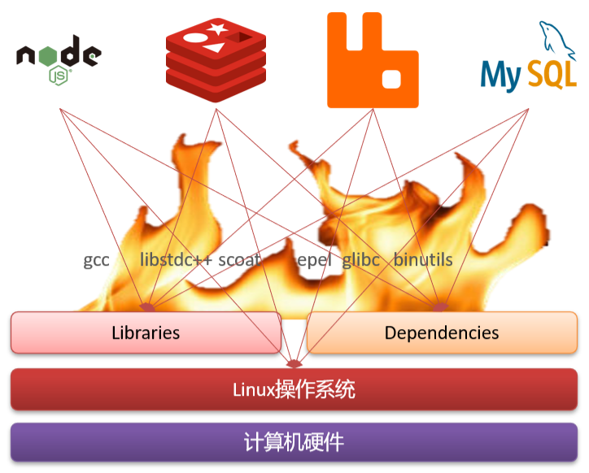

**Docker**
Docker如何解决依赖的兼容问题的？

- 将应用的Libs（函数库）、Deps（依赖）、配置与应用一起打包
- 将每个应用放到一个隔离容器去运行，避免互相干扰

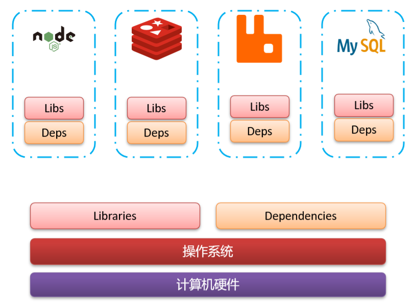

内核与硬件交互，提供操作硬件的指令
系统应用封装内核指令为函数，便于程序员调用
用户程序基于系统函数库实现功能

Ubuntu和CentOS都是基于Linux内核，只是系统应用不同，提供的函数库有差异


Docker如何解决不同系统环境的问题？

- Docker将用户程序与所需要调用的系统(比如Ubuntu)函数库一起打包
- Docker运行到不同操作系统时，直接基于打包的库函数，借助于操作系统的Linux内核来运行

Docker如何解决大型项目依赖关系复杂，不同组件依赖的兼容性问题？

- Docker允许开发中将应用、依赖、函数库、配置一起打包，形成可移植镜像
- Docker应用运行在容器中，使用沙箱机制，相互隔离

Docker如何解决开发、测试、生产环境有差异的问题

- Docker镜像中包含完整运行环境，包括系统函数库，仅依赖系统的Linux内核，因此可以在任意Linux操作系统上运行

## 1.2、Docker和虚拟机的区别

虚拟机（virtual machine）是在操作系统中模拟硬件设备，然后运行另一个操作系统，比如在 Windows 系统里面运行 Ubuntu 系统，这样就可以运行任意的Ubuntu应用了。
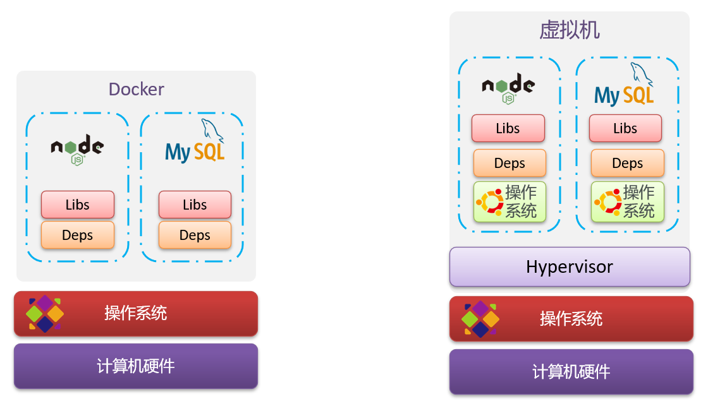

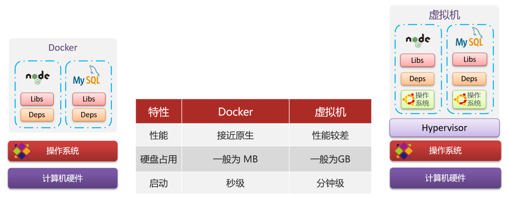

Docker和虚拟机的差异：

- docker是一个系统进程；虚拟机是在操作系统中的操作系统
- docker体积小、启动速度快、性能好；虚拟机体积大、启动速度慢、性能一般

**镜像和容器**
镜像（Image）：Docker将应用程序及其所需的依赖、函数库、环境、配置等文件打包在一起，称为镜像。
容器（Container）：镜像中的应用程序运行后形成的进程就是容器，只是Docker会给容器做隔离，对外不可见。

**Docker和DockerHub**
DockerHub：DockerHub是一个Docker镜像的托管平台。这样的平台称为Docker Registry。
国内也有类似于DockerHub 的公开服务，比如 网易云镜像服务、阿里云镜像库等。

## 1.3、Docker架构

Docker是一个CS架构的程序，由两部分组成：

- 服务端(server)：Docker守护进程，负责处理Docker指令，管理镜像、容器等
- 客户端(client)：通过命令或RestAPI向Docker服务端发送指令。可以在本地或远程向服务端发送指令。

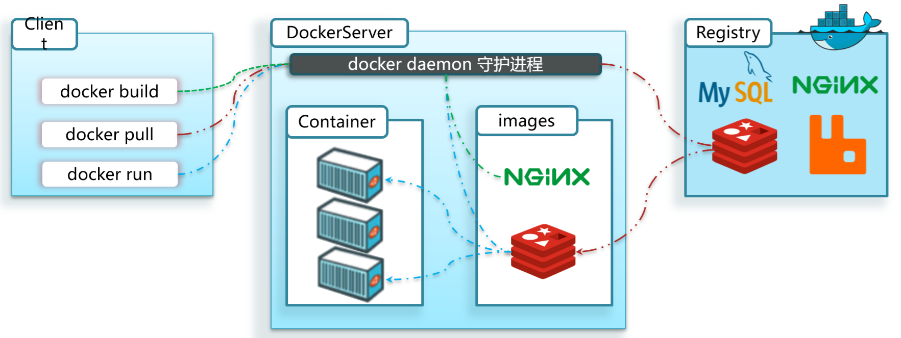

## 1.4、安装Docker

# 二、Docker的基本操作

镜像相关命令

- 镜像名称一般分两部分组成：[repository]:[tag]。
- 在没有指定tag时，默认是latest，代表最新版本的镜像

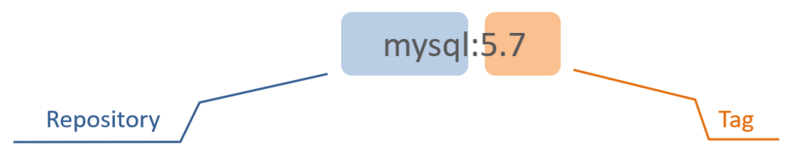

## 2.1、镜像操作

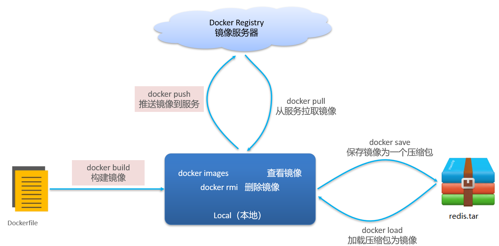

## 2.2、容器操作

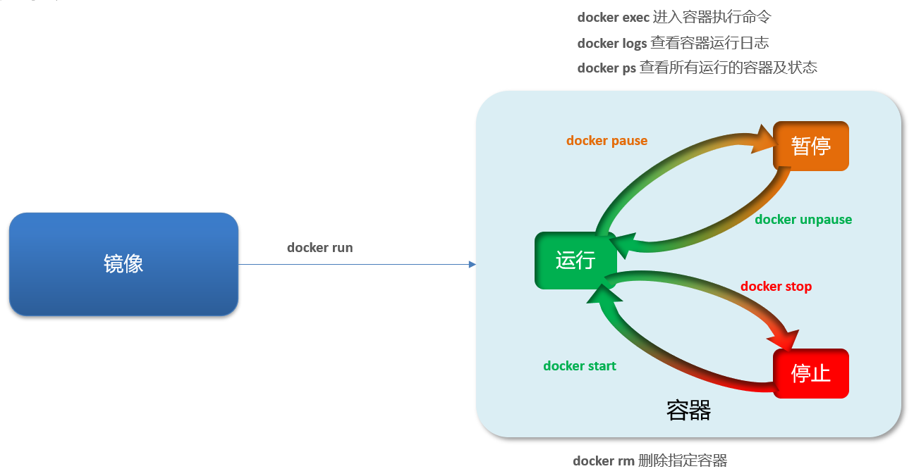

创建运行一个Nginx容器

```shell
docker run --name containerName -p 80:80 -d nginx
```

命令解读：
- docker run ：创建并运行一个容器
- --name : 给容器起一个名字，比如叫做mn
- -p ：将宿主机端口与容器端口映射，冒号左侧是宿主机端口，右侧是容器端口
- -d：后台运行容器
- nginx：镜像名称，例如nginx

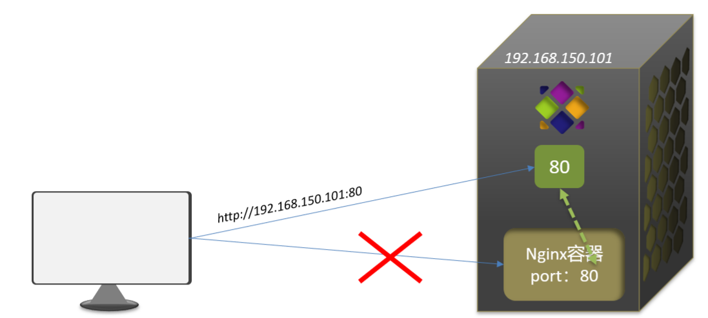

进入Nginx容器，修改HTML文件内容，添加“欢迎您”
步骤一：进入容器。进入我们刚刚创建的nginx容器的命令为：
```shell
docker exec -it mn bash
```
命令解读：
- docker exec ：进入容器内部，执行一个命令
- -it : 给当前进入的容器创建一个标准输入、输出终端，允许我们与容器交互
- mn ：要进入的容器的名称
- bash：进入容器后执行的命令，bash是一个linux终端交互命令

步骤二：进入nginx的HTML所在目录 /usr/share/nginx/html
```shell
cd /usr/share/nginx/html
```

步骤三：修改index.html的内容
```shell
sed -i 's#Welcome to nginx#欢迎您#g' index.html
sed -i 's#<head>#<head><meta charset="utf-8">#g' index.html
```

## 2.3、数据卷（容器数据管理）
容器与数据耦合的问题
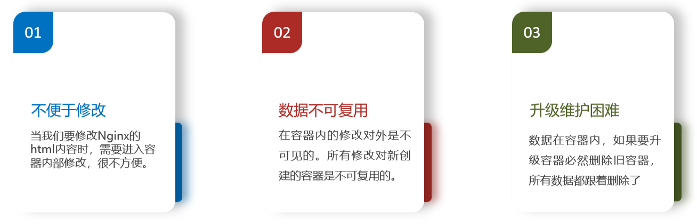

数据卷（volume）是一个虚拟目录，指向宿主机文件系统中的某个目录。
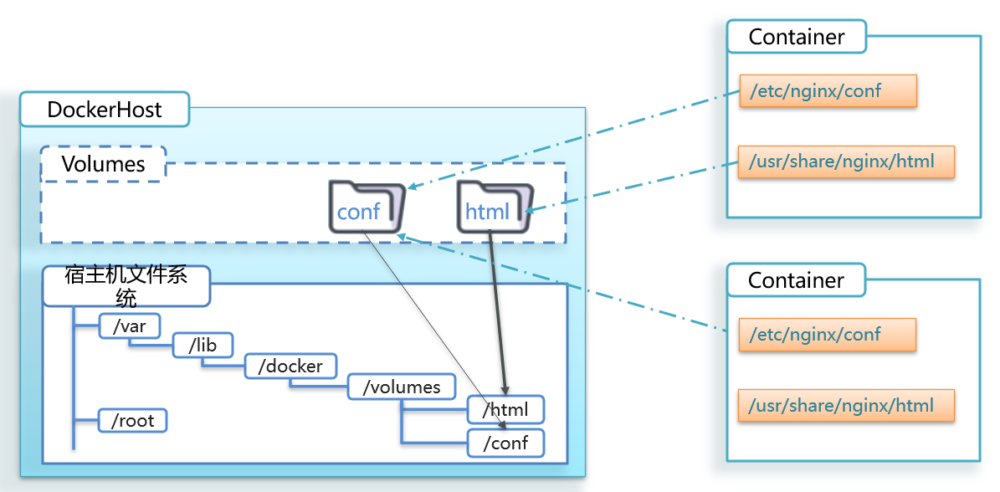

数据卷操作的基本语法如下：
```shell
docker volume [COMMAND]
```
docker volume命令是数据卷操作，根据命令后跟随的command来确定下一步的操作：
- create：创建一个volume
- inspect：显示一个或多个volume的信息
- ls：列出所有的volume
- prune：删除未使用的volume
- rm：删除一个或多个指定的volume

创建一个数据卷，并查看数据卷在宿主机的目录位置
①创建数据卷
```shell
sudo docker volume create html
```
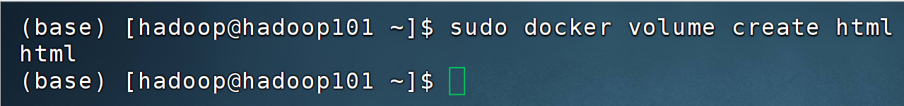
②查看所有数据
```shell
sudo docker volume ls
```
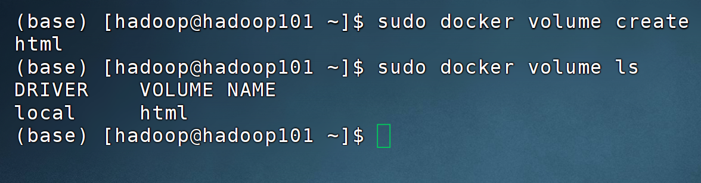
③查看数据卷详细信息卷
```shell
sudo docker volume inspect html
```
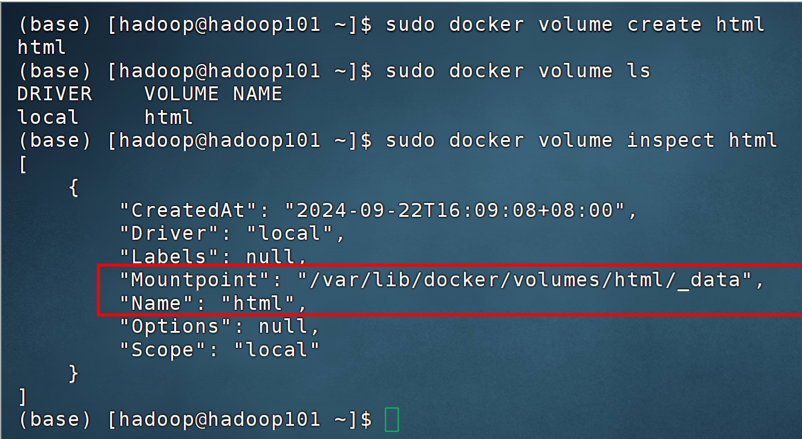

**挂载数据卷**
我们在创建容器时，可以通过 -v 参数来挂载一个数据卷到某个容器目录
```shell
docker run --name mn -v html:/root/html -p 8080:80 nginx
```
命令解读：
- docker run ：就是创建并运行容器
- -- name mn ：给容器起个名字叫mn
- -v html:/root/htm ：把html数据卷挂载到容器内的/root/html这个目录中
- -p 8080:80 ：把宿主机的8080端口映射到容器内的80端口
- nginx ：镜像名称

**挂载目录**
目录挂载与数据卷挂载的语法是类似的：
-v [宿主机目录]:[容器内目录]
-v [宿主机文件]:[容器内文件]

数据卷挂载的方式对比
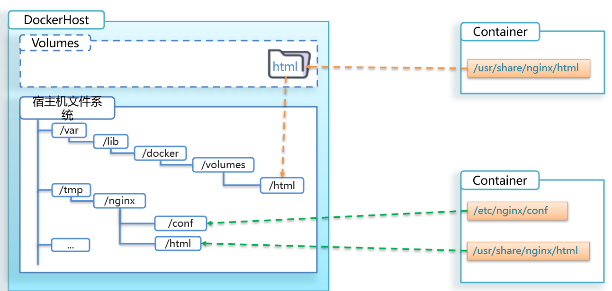

docker run的命令中通过 -v 参数挂载文件或目录到容器中：
- -v volume名称:容器内目录
- -v 宿主机文件:容器内文件
- -v 宿主机目录:容器内目录

数据卷挂载与目录直接挂载的
- 数据卷挂载耦合度低，由docker来管理目录，但是目录较深，不好找
- 目录挂载耦合度高，需要我们自己管理目录，不过目录容易寻找查看

## 2.4、网络


# 三、Dockerfile自定义镜像
## 3.1、镜像结构
镜像是将应用程序及其需要的系统函数库、环境、配置、依赖打包而成。
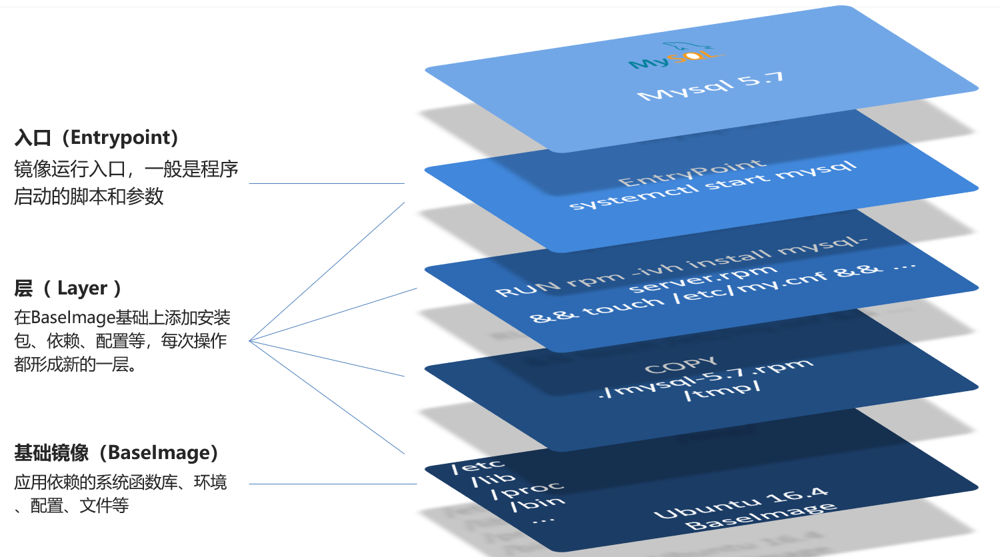

镜像是分层结构，每一层称为一个Layer
- BaseImage层：包含基本的系统函数库、环境变量、文件系统
- Entrypoint：入口，是镜像中应用启动的命令
- 其它：在BaseImage基础上添加依赖、安装程序、完成整个应用的安装和配置

**什么是Dockerfile**
Dockerfile就是一个文本文件，其中包含一个个的指令(Instruction)，用指令来说明要执行什么操作来构建镜像。每一个指令都会形成一层Layer。
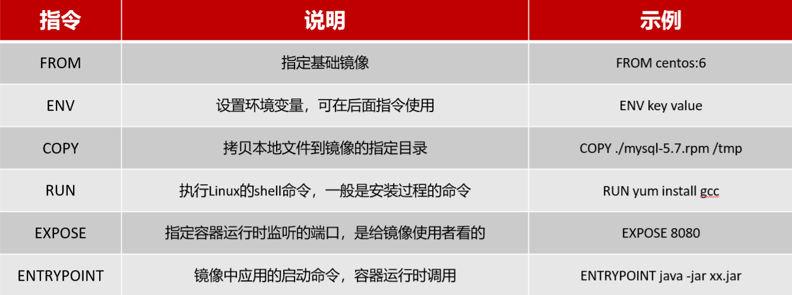

更新详细语法说明，请参考官网文档： https://docs.docker.com/engine/reference/builder


## 3.2、DockerFile语法

## 3.3、构建Java项目


# 四、Docker-Compose
## 4.1、初识DockerCompose
Docker Compose可以基于Compose文件帮我们快速的部署分布式应用，而无需手动一个个创建和运行容器！
Compose文件是一个文本文件，通过指令定义集群中的每个容器如何运行。
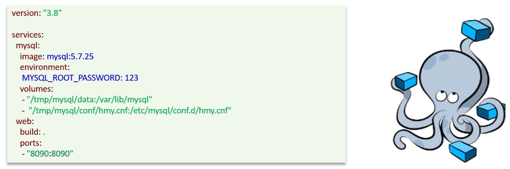
DockerCompose的详细语法参考官网：https://docs.docker.com/compose/compose-file/


## 4.2、部署微服务集群


# 五、Docker镜像仓库
## 5.1、搭建私有镜像仓库
**常见镜像仓库服务**
镜像仓库（Docker Registry）有公共的和私有的两种形式：
- 公共仓库：例如Docker官方的Docker Hub，国内也有一些云服务商提供类似于Docker Hub的公开服务，比如网易云镜像服务、DaoCloud镜像服务、阿里云镜像服务等。
- 除了使用 公开仓库外，用户还可以在本地搭建私有 Docker Registry。企业自己的镜像最好是采用私有Docker Registry来实现。

## 5.2、向镜像仓库推送镜像
推送镜像到私有镜像服务必须先tag，步骤如下：
①重新tag本地镜像，名称前缀为私有仓库的地址：192.168.230.101:8080/
```shell
docker tag nginx:latest 192.168.150.101:8080/nginx:1.0 
```
②推送镜像
```shell
docker push 192.168.150.101:8080/nginx:1.0 
```
③拉取镜像
```shell
docker pull 192.168.150.101:8080/nginx:1.0 
```

## 5.3、从镜像仓库拉取镜像


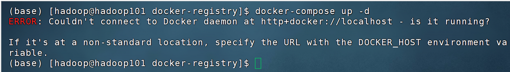